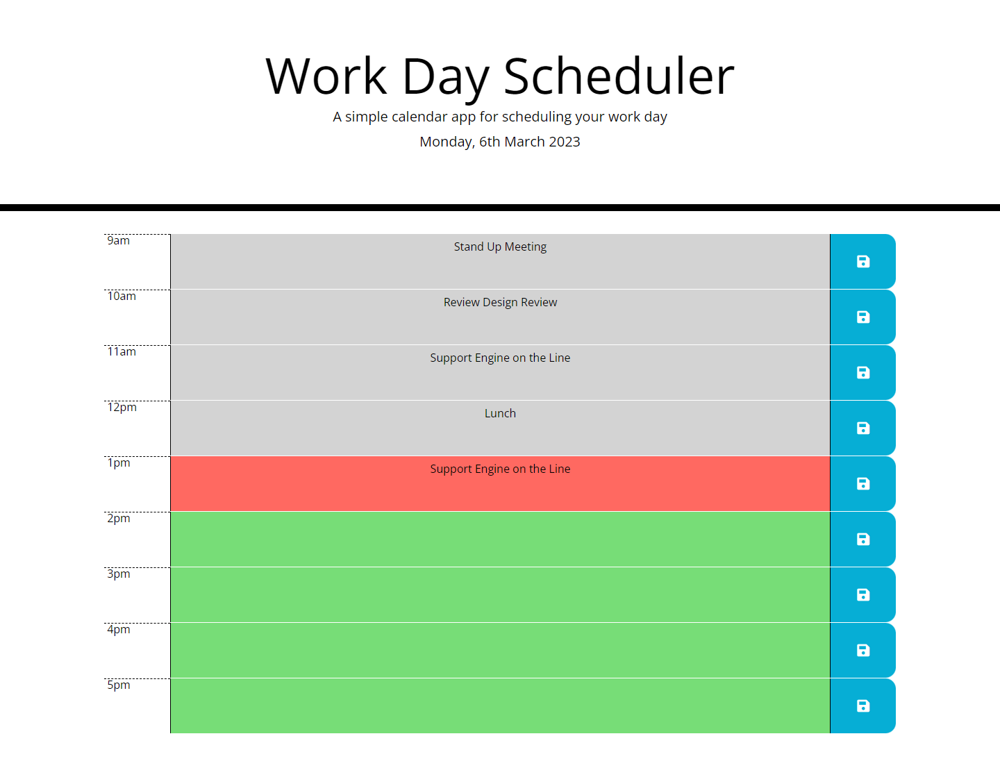

# DailyPlanner

## Introduction

Webpage deployed at: https://bh00fie.github.io/DailyPlanner/

In this challenge, I'll be creating a simple calendar application that allows a user to save events for each hour of the day by modifying the starter code given to me and using the concepts I've learned in the few last weeks.
In this project, I'll be creating a calendar that will show the current day (using Moment.js) and that allows the user to store hourly notes when clicking the save button.

## Description

The app should:
- Display the current day at the top of the calendar when a user opens the planner. 
- Present time blocks for standard business hours when the user scrolls down.
- Color-code each time block based on past, present, and future when the time block is viewed.
- Allow a user to enter an event when they click a time block.
- Save the event in local storage when the save button is clicked in that time block.
- Persist events between refreshes of a page.

JS file has been commented on to help understand written code if interested in looking into it more in-depth.

The code has been deployed on the following webpage: https://bh00fie.github.io/DailyPlanner/

## Final Results
When you open your code in the browser my resulting Daily Planner should look similar to the following:

---

## License

MIT Licence

---

© 2022 edX Boot Camps LLC. Confidential and Proprietary. All Rights Reserved.